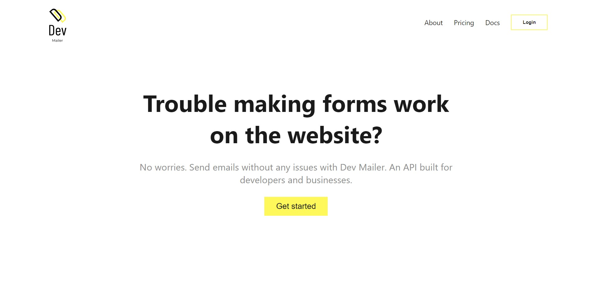
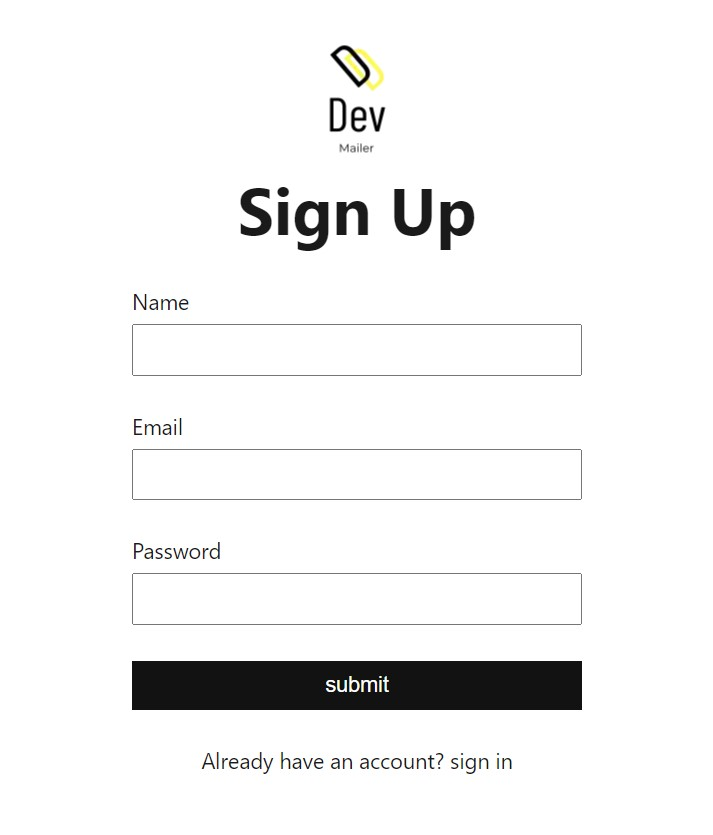
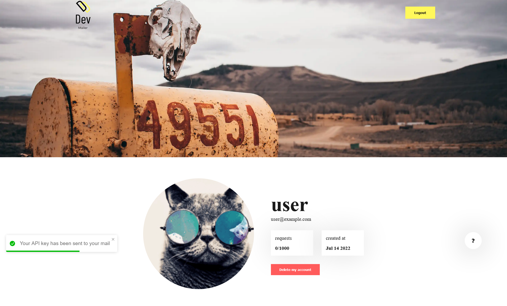
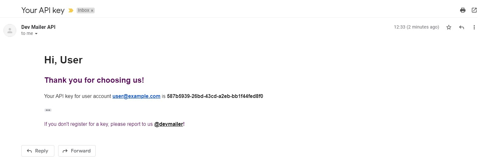
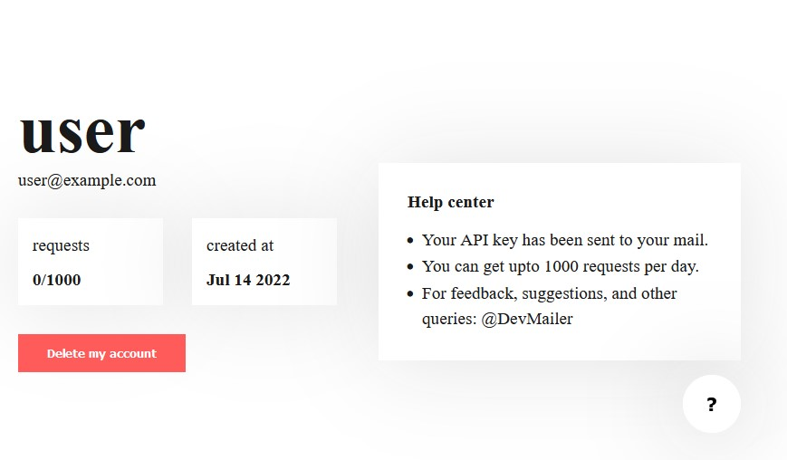

# Getting Started

Let's discover about **Dev Mailer in less than 5 minutes**.

## Steps to follow 📖

Let's get started!

### 1. Create a new account

###### a) Go to the DevMailer official site.

###### b) Click on **Get started**.

### 2. Complete the registration

### 3. You will be redirected to the dashboord

### 4. Check your mail

You will receive your API key only in your mail, So please store it safely with you. Once the key is lost, you **won't be able to recover** it.

### 5. For any help click the help icon

